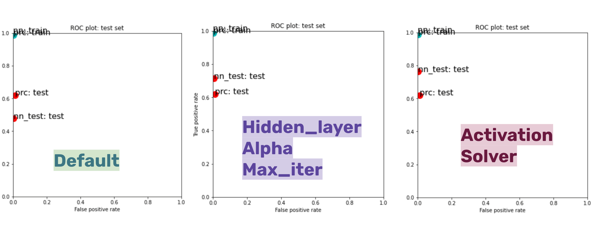

## Image Recognition | Perceptron & Neural Network

In this assignment, I tested out both Perceptron and Neural Network (multi-layer Perceptron) to identify airplanes in images.

### Process

**Iteration 1**: I made three steps of modifications to the starter code - the first two steps on the feature set of the MLPClassifier and the last step on the image processing.

Step 1: Drawing from previous lessons, I know a model sometimes benefits from greater max number of iterations and improved regulations. I increased the hidden_layer_size, max_iter, and tested out a much smaller alpha value: hidden_layer_sizes=(200,100,50) alpha=0.0000001, max_iter=3000. I saw an improvement in MLPClassifier test set performance.

Step 2: Drawing from Skimage documentation, I changed activation to identity which “is useful to implement linear bottleneck” and solver to lbfgs, which is said to converge faster and perform better. I saw an improvement in test set outcome but a true positive rate that is shy of 0.8 indicates further modification is needed.

Step 3: I then moved onto image processing after examining the false positive and false negative images. It seems that the horizontal line and noises contribute to the mis-categorizations. I researched to find a method to remove noises and adopted Gaussian_blur filter, a rather subtle change to the original image processing method. In the end, I saw the test set outcome was worsen. Further research and testing are needed.

[Jupyter Notebook](https://github.com/muonius/msdv-machine-learning/blob/master/deep_learning/planeimages_yang_v06_submission01.ipynb)

**Iteration 2**: Before testing out hidden layers, I wanted to further fine-tune image processing left over from last time. I tried a bunch of different features and filters, and most of them worsened the performance. I even tried Histogram Equalization which is said to improve exposure, but didn’t see an improvement. At the end, I settled with corner_harris(method='k', k=0.05, eps=1e-06, sigma=2) with a promising TPR of 0.9.

Next, while keeping all other parameters and settings constant, I looped through a list of [100,150,200,250] with each element representing a hidden layer number. The test result showed that the TPR remained at 0.9. I did get the best accuracy when hidden layer is equal to 200. The almost invisible change might be attributed to that I over-optimized other features so I decided it’s time to submit my test result and see where to improve further.

At this point, I realized I couldn't go any further with Neural Network. So for my 3rd iteration, I decided to switch gears and use Histogram of Oriented Gradients (HOG) and simple Perceptron.

[Jupyter Notebook](https://github.com/muonius/msdv-machine-learning/blob/master/deep_learning/planeimages_yang_v08_hog_perceptron_submission02.ipynb)

**Iteration 3**: Since HOG really surfaces the complexity of images to its surface layer. It seems to me the HOG feature is enough for image processing and any additional filters will mess up with HOG. And because of the single layer complexity, Perceptron is preferred over Neural Network.

[Jupyter Notebook](https://github.com/muonius/msdv-machine-learning/blob/master/deep_learning/planeimages_yang_v09_hog_perceptron_submission03.ipynb)
