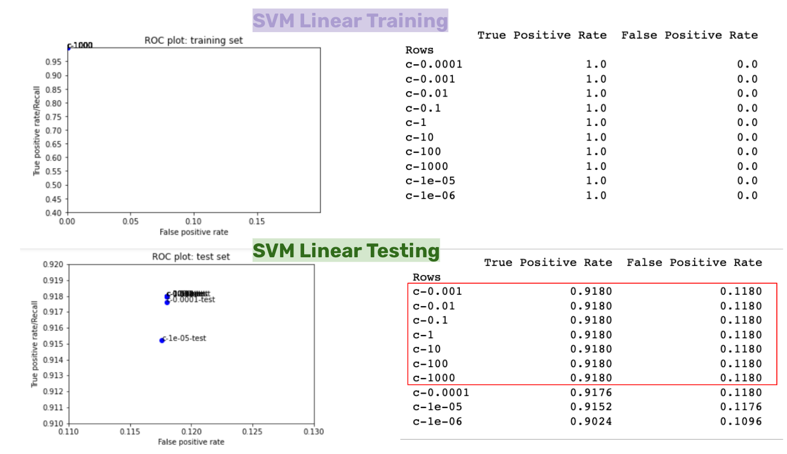

## Movie Review | Natural Language Processing

In this assignment, I applied common Natural Language Processing techniques to process IMDb movie reivews and predict whether they are positive or negative reviews.

- I custom made a text preprocessor using NLTK package and regular expressions and experimented with concepts such as normalization and tokenization, part-of-speech tagging and lemmatization.

- I applied the Bag-of-Words langage model in conjunction with Tf-Idf.

- I ran a series of linear models and settled with Ridge Regression model for my training model.

### Process

**Step 1**: After reviewing the starter-code, I decided to simplify it first and bring it to its simpliest form, which would be my baseline. Looking at the ROC chart comparison, I know that for my corpus, the baseline TPR is around 85% and FPR around 16%. I then played around with minor tweaks on model setup with increased complexity.

**Step 2**: Next, I passed in a custom text preprocessor to the `CounterVectorizer()` function and I saw a major improvement in the Ridge Regression model.

**Step 3**: I began testing `alpha` value for the Ridge Regression model. I tested values using a linear scale from default 1 to 16,000 in increments of 500. The test suggested I achieved the highest TPR and lowest FPR when the `alpha` value is around 16,000.

This is when I submitted my first result. Upon reviewing the [test outcome](https://github.com/visualizedata/ml/blob/master/iterations/ML_1_01_moviereviews.ipynb), I know that my model might have some overfitting issue. In addition, I know I applied a rather small `alpha` value.

**Step 5**: I moved on to experimenting `C value` for the Support Vector Machine Linear model. A small `C value` creates soft margin that allows more mistakes but regulates the model while bigger `C value` creates greater margin. This time, I learned to test my `C value` in logarithmic scale of 1e-06, 1e-05, 1e-04, 1e-03....100, and 1000. The result indicated that I achieved the highest TPR and lowest FPR with a minimum `C value` of 0.001.

**Step 6**: Going back to Ridge Regression, I bumped the `alpha` in logarithmic scale. However, my performance did not improve. I decided to remove my own text preprocessor and again, bring the model to baseline. After clearing up the preprocessor, a larger `alpha` did bring a lot better result but is it an overfitting?

